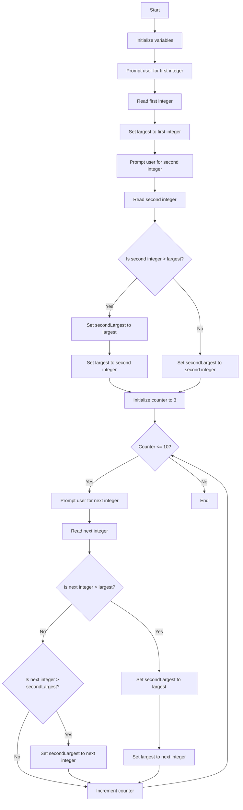

# Solutions to Exercise 3.9 (Find the Two Largest Numbers)

- [C++ Code file](e03_09.cpp)
- Explanation:

```mermaid
graph TD
    A[Start] --> B[Initialize variables]
    B --> C[Prompt user for first integer]
    C --> D[Read first integer]
    D --> E[Set largest to first integer]
    E --> F[Prompt user for second integer]
    F --> G[Read second integer]
    G --> H{Is second integer > largest?}
    H -->|Yes| I[Set secondLargest to largest]
    I --> J[Set largest to second integer]
    H -->|No| K[Set secondLargest to second integer]
    J --> L[Initialize counter to 3]
    K --> L
    L --> M{Counter <= 10?}
    M -->|Yes| N[Prompt user for next integer]
    N --> O[Read next integer]
    O --> P{Is next integer > largest?}
    P -->|Yes| Q[Set secondLargest to largest]
    Q --> R[Set largest to next integer]
    P -->|No| S{Is next integer > secondLargest?}
    S -->|Yes| T[Set secondLargest to next integer]
    S -->|No| U[Increment counter]
    T --> U
    R --> U
    U --> M
    M -->|No| V[End]
```

---

- [Next: Exercise 3.10](03_10.md)
- [Back: to Chapter 3](README.md)
